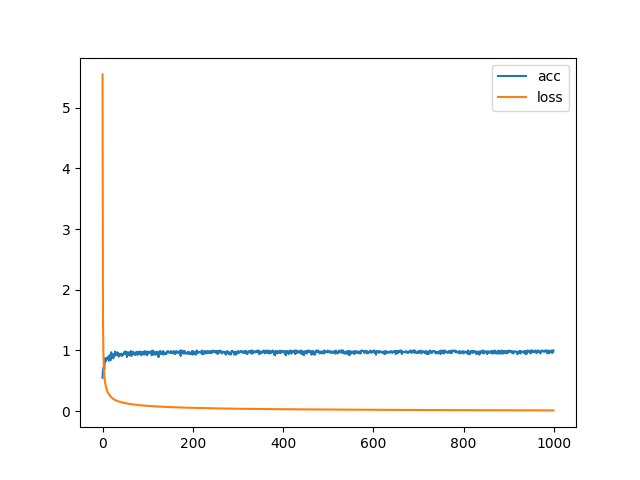
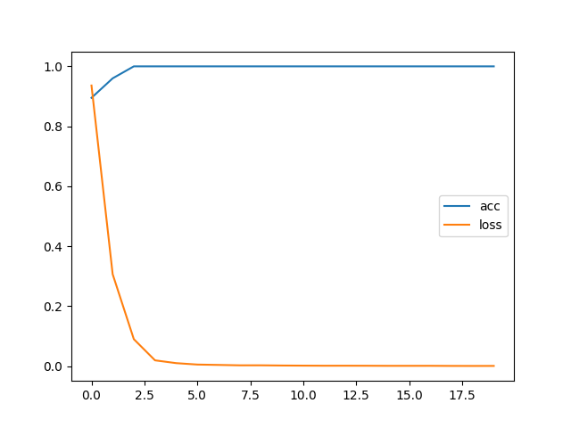
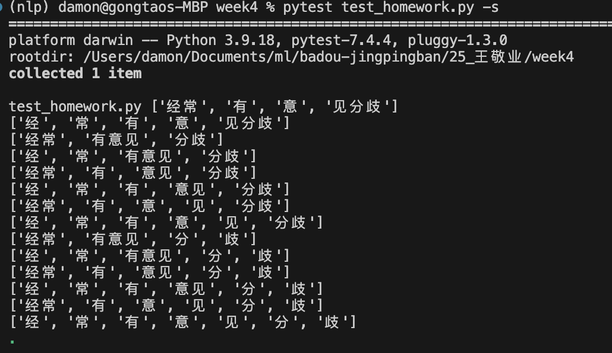
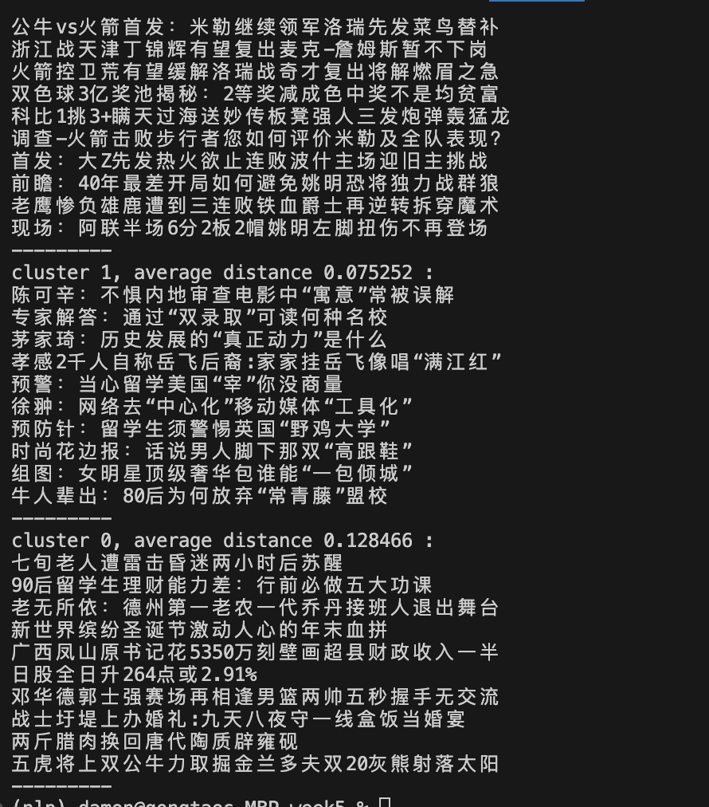

# 作业


## 环境要求

确保已安装必要的依赖项：
```bash
pip install torch numpy matplotlib
```
## 第二周

### 内容
修改torchdemo中的任务为多分类任务，完成训练。

#### 任务
随机生成6个整数，取最小值的索引，然后用这个索引取余，用余数作为target。生成sample代码如下：

```python
def build_sample():
    x = np.random.randint(low=0,high=100,size=6)
    # 获取最小值的索引
    min_index = np.argmin(x)
    if min_index % 3 == 0:
        return x, 0
    elif min_index % 3 == 1:
        return x, 1
    else:
        return x, 2
```

#### 模型结构

该模型包含两个全连接层：
1. **隐藏层：** 具有ReLU激活函数的全连接层。
2. **输出层：** 具有softmax激活函数的另一个全连接层。

#### 结果
结果如图所示：  



## 第三周

#### 内容
这个项目是一个基于 PyTorch 的简单 NLP 任务实现，目标是判断文本中字符 'a' 所在的位置。

#### 模型架构
模型采用了一个包含嵌入层、RNN 层和线性层的简单神经网络。

嵌入层： 将输入文本中的字转换为密集向量。
RNN 层： 通过 RNN 处理序列数据，捕捉文本中的依赖关系。
线性层： 用于最终的分类。
#### 结果
结果如图所示：  



## 第四周

#### 内容
完成字符串的全切分

#### 结果
结果如图所示：  


## 第五周

#### 内容
计算类内距离

#### 结果
结果如图所示：  
