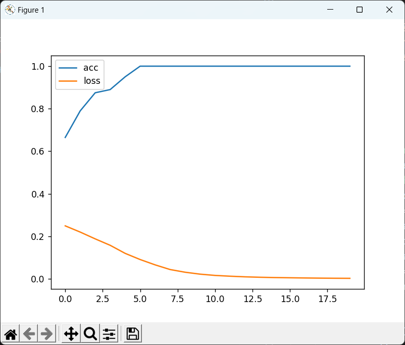
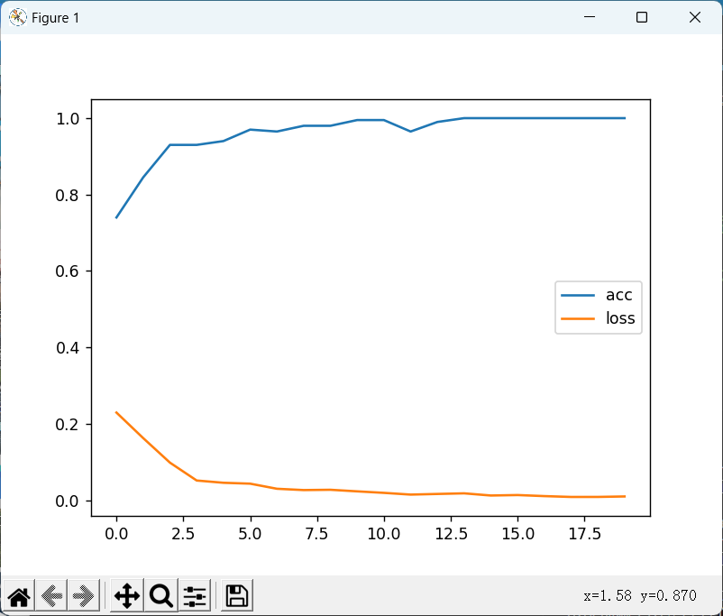

### 在原始模型的基础上增加RNN层


#### 未增加RNN层训练结果



```
=========
第1轮平均loss:0.249492
本次预测集中共有109个正样本，91个负样本
正确预测个数：133, 正确率：0.665000
=========
第2轮平均loss:0.220250
本次预测集中共有102个正样本，98个负样本
正确预测个数：158, 正确率：0.790000
=========
第3轮平均loss:0.188362
本次预测集中共有102个正样本，98个负样本
正确预测个数：175, 正确率：0.875000
=========
第4轮平均loss:0.158129
本次预测集中共有102个正样本，98个负样本
正确预测个数：178, 正确率：0.890000
=========
第5轮平均loss:0.120250
本次预测集中共有106个正样本，94个负样本
正确预测个数：190, 正确率：0.950000
=========
第6轮平均loss:0.091268
本次预测集中共有107个正样本，93个负样本
正确预测个数：200, 正确率：1.000000
=========
第7轮平均loss:0.066190
本次预测集中共有91个正样本，109个负样本
正确预测个数：200, 正确率：1.000000
=========
第8轮平均loss:0.044234
本次预测集中共有90个正样本，110个负样本
正确预测个数：200, 正确率：1.000000
=========
第9轮平均loss:0.031588
本次预测集中共有111个正样本，89个负样本
正确预测个数：200, 正确率：1.000000
=========
第10轮平均loss:0.022548
本次预测集中共有101个正样本，99个负样本
正确预测个数：200, 正确率：1.000000
=========
第11轮平均loss:0.016554
本次预测集中共有92个正样本，108个负样本
正确预测个数：200, 正确率：1.000000
=========
第12轮平均loss:0.012886
正确预测个数：200, 正确率：1.000000
```


#### 增加RNN层训练结果



```
=========
第1轮平均loss:0.208456
本次预测集中共有91个正样本，109个负样本
正确预测个数：171, 正确率：0.855000
=========
第2轮平均loss:0.110118
本次预测集中共有106个正样本，94个负样本
正确预测个数：182, 正确率：0.910000
=========
第3轮平均loss:0.055206
本次预测集中共有117个正样本，83个负样本
正确预测个数：188, 正确率：0.940000
=========
第4轮平均loss:0.044650
本次预测集中共有90个正样本，110个负样本
正确预测个数：191, 正确率：0.955000
=========
第5轮平均loss:0.037694
本次预测集中共有97个正样本，103个负样本
正确预测个数：187, 正确率：0.935000
=========
第6轮平均loss:0.038109
本次预测集中共有105个正样本，95个负样本
正确预测个数：191, 正确率：0.955000
=========
第7轮平均loss:0.022794
本次预测集中共有108个正样本，92个负样本
正确预测个数：189, 正确率：0.945000
=========
第8轮平均loss:0.025023
本次预测集中共有95个正样本，105个负样本
正确预测个数：192, 正确率：0.960000
=========
第9轮平均loss:0.021652
本次预测集中共有107个正样本，93个负样本
正确预测个数：194, 正确率：0.970000
=========
第10轮平均loss:0.022684
本次预测集中共有106个正样本，94个负样本
正确预测个数：198, 正确率：0.990000
=========
第11轮平均loss:0.020620
本次预测集中共有102个正样本，98个负样本
正确预测个数：197, 正确率：0.985000
=========
第12轮平均loss:0.017606
本次预测集中共有103个正样本，97个负样本
正确预测个数：199, 正确率：0.995000
=========
第13轮平均loss:0.018205
本次预测集中共有91个正样本，109个负样本
正确预测个数：200, 正确率：1.000000
=========
第18轮平均loss:0.008743
本次预测集中共有100个正样本，100个负样本
正确预测个数：200, 正确率：1.000000
=========
第19轮平均loss:0.008417
本次预测集中共有96个正样本，104个负样本
正确预测个数：200, 正确率：1.000000
=========
第20轮平均loss:0.007734
本次预测集中共有99个正样本，101个负样本
正确预测个数：200, 正确率：1.000000
```


#### 对比

增加RNN层后模型在训练前5轮，比直接使用分类层的效果好
