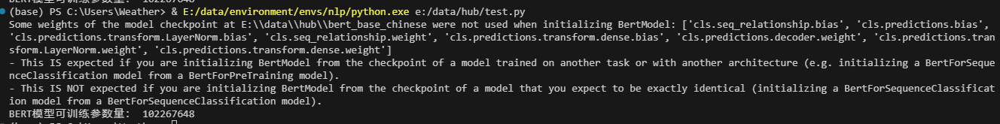

# BERT模型可训练参数量计算过程

## 计算过程

#### 模型参数

```
bert_base_chinese
{
  "architectures": [
    "BertForMaskedLM"
  ],
  "attention_probs_dropout_prob": 0.1,
  "directionality": "bidi",
  "hidden_act": "gelu",
  "hidden_dropout_prob": 0.1,
  "hidden_size": 768,
  "initializer_range": 0.02,
  "intermediate_size": 3072,
  "layer_norm_eps": 1e-12,
  "max_position_embeddings": 512,
  "model_type": "bert",
  "num_attention_heads": 12,
  "num_hidden_layers": 12,
  "pad_token_id": 0,
  "pooler_fc_size": 768,
  "pooler_num_attention_heads": 12,
  "pooler_num_fc_layers": 3,
  "pooler_size_per_head": 128,
  "pooler_type": "first_token_transform",
  "type_vocab_size": 2,
  "vocab_size": 21128
}
```


#### embedding 层

    bert中的embedding有三种，分别为word embedding、position embedding、sentence embedding。
    
    word embedding: vocab_size * hidden_size = 21128*768
    position embedding: max_position_embeddings * hidden_size = 512*768
    sentence embedding: type_vocab_size * hidden_size = 2*768
    
    在embedding层最后有Layer Norm层，该层的可训练参数为（缩放和平移参数）  hidden_size * 2 = 768 * 2
    
    embedding层的总参数为 21128*768+512*768+2*768+768*2 =16622592


#### self-attention层

```
self-attention 一共有12层，每层中有两部分组成，分别为multihead-Attention 和Layer Norm层

multihead-Attention 中有Q、K、V三个转化矩阵和一个拼接矩阵，Q、K、V的shape为：

hidden_size * num_attention_heads * (hidden_size /num_attention_heads ) = 768*12*64 +768 

第一个768为embedding维度，12为head数量，64为子head的维度，最后加的768为模型中的bias。

经过Q、K、V变化后的数据需要concat起来，额外需要一个768*768+768的拼接矩阵。

Layer Norm参数量：768+768

self-attention一层中的参数为：
(768*12*64 +768)*3+768*768+768 +768+768=2363904
一共12层，2363904 *12 = 28366848
```


#### feedforward层

```
 feedforward 一共有12层，每层中有两个全连接层组成，分别为feedforward和Layer Norm层，形状分别为（hidden_size，intermediate_size），（intermediate_size，hidden_size）
 
一层 feedforward ：(768 * 3072 + 3072) + (3072 * 768 + 768) 
Layer Norm参数量：768+768

 feedforward：((768 * 3072 + 3072) + (3072 * 768 + 768) + (768+768))* 12 = 56687616
 
```


#### pooler层

```
在feedforward层后还有一个pooler层，维度为hidden_size*hidden_size，参数量为(weights+bias)，为获取训练数据中第一个特殊字符[CLS]的词向量，进一步计算bert中的NSP任务中的loss

pooler: hidden_size*hidden_size + hidden_size = 590592
```


#### 总参数

```
embedding + self-attention + feedforward + pooler = 16622592 + 28366848 + 56687616 + 590592 = 102267648

其中embedding层16.25%，self-attention层27.74%，feedforward层55.43%
```

## 验证

直接打印模型参数



与计算结果一致


#### 补充

Layer Normalization（层归一化）的结构如下：

给定输入 $x = (x_1, x_2, ..., x_d)$，其中 $d$ 是输入特征的维度。Layer Normalization 对输入进行归一化，然后应用缩放和平移操作。

1.**均值和方差的计算**：

Layer Normalization 首先计算输入特征的均值 $\mu$ 和方差 $\sigma^2$。对于输入 $x$，均值 $\mu$ 和方差 $\sigma^2$ 的计算方式如下：
$$
\begin{array}{c}\mu=\frac{1}{d} \sum_{i=1}^{d} x_{i} \\ \sigma^{2}=\frac{1}{d} \sum_{i=1}^{d}\left(x_{i}-\mu\right)^{2}\end{array}
$$
2.**归一化**：

使用计算得到的均值 $\mu$ 和方差 $\sigma^2$ 对输入 $x$ 进行归一化操作：
$$
\hat{x}_{i}=\frac{x_{i}-\mu}{\sqrt{\sigma^{2}+\epsilon}}
$$
其中 $\epsilon$ 是一个很小的常数，用于防止方差为零的情况。

3.**缩放和平移**：

对归一化后的结果 $\hat{x}$ 应用缩放参数 $\gamma$ 和平移参数 $\beta$：(其中 $\gamma$ 和 $\beta$ 是需要学习的参数。)	
$$
y_i=\gamma\hat{x} +\beta
$$
以上就是一个 Layer Normalization 层的结构。在训练过程中，$\gamma$ 和 $\beta$ 会通过反向传播进行更新，以最小化损失函数。在推理过程中，$\gamma$ 和 $\beta$ 是固定的，可以根据训练好的模型参数直接计算得到输出。


