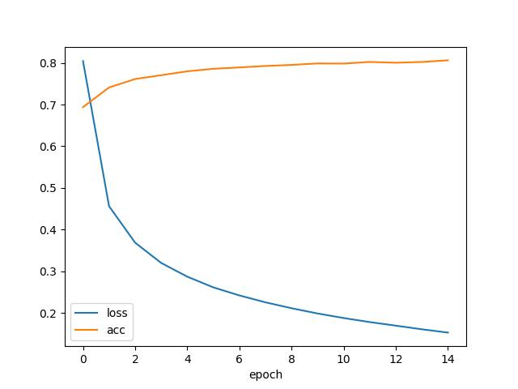

# Chinese-Word-Segmentation
pytorch实现，基于双向GRU的通用新闻中文分词模型

## 分词效果
- 同时 国内 有望 出台 新 汽车 刺激 方案 
- 沪胶 后市 有望 延续 强势 ， 经过 两 个 交易日 的 强势 调整 后 ， 昨日 上海 天然 橡胶 期货 价格 再度 大幅 上扬 
- 中国 政府 将 继续 奉行 独立自主 的 外交 政策 ， 在 和平共处 五 项 原则 的 基础 上 努力 发展 同 世界 各国 的 友好 关系

## 数据集
分词-中文-新闻领域数据集PKU
https://modelscope.cn/datasets/dingkun/chinese_word_segmentation_pku/summary
- 使用BIES标签体系标注
```
在 这 辞 旧 迎 新 的 美 好 时 刻 ， 我 祝 大 家 新 年 快 乐 ， 家 庭 幸 福 ！
S-CWS S-CWS B-CWS I-CWS I-CWS E-CWS S-CWS B-CWS E-CWS B-CWS E-CWS S-CWS S-CWS S-CWS B-CWS E-CWS B-CWS E-CWS B-CWS E-CWS S-CWS B-CWS E-CWS B-CWS E-CWS S-CWS
```

## 网络结构
- input_dim=50
- embedding layer
- 双向GRU (hidden_size=400 num_layers=3)
- linear
- output_dim=4
- CrossEntropyLoss


## 训练
模型采用1张NVIDIA A6000训练
### 超参数
```
train_epochs=15
max_sequence_length=256
batch_size=125
learning_rate=5e-5
optimizer=AdamW
```
### 训练过程

